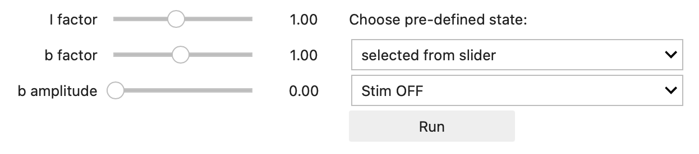
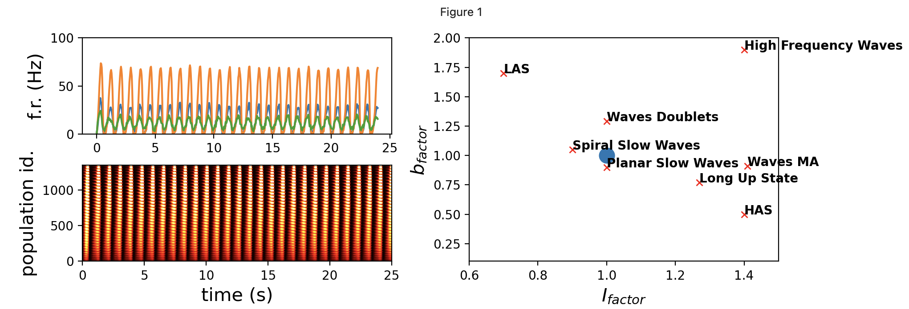
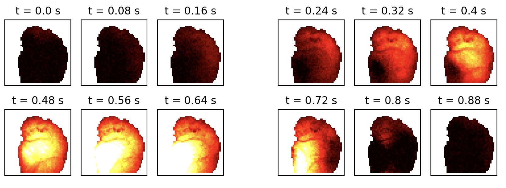
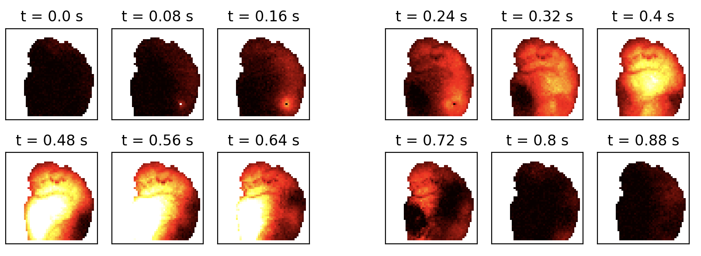

# InteractiveExplorationBrainStates

Interactive Exploration of Brain States and Spatio-Temporal Activity Patterns in Data-Constrained Simulations

How the same network can generate different brain states with their specific propagation patterns and rhythms?

In this Jupyter Lab environment, the user can interactively change the neuromodulationo and adaptation parameters and observe in real-time the emergence of different categories of slow-wave wave-propagation patterns (spontaneous and stimulated) and the transition to an asynchronous regime on a columnar mean-field model equipped with lateral connections inferred from experimentally acquired cortical activity.

The model displays the dorsal view of a mouse cortical hemisphere sampled by pixels of 100-micron size over a 25 mm2 field of view.

Stimulus OFF

Stimulus ON

The connectivity of the model was inferred from cortical activity acquired using GECI imaging technique. Even if the connectivity of the model was inferred from a single brain-state, the neuromodulated model supports the emergence of a rich dynamic repertoire of spatio-temporal propagation patterns, from those corresponding to deepests levels of anesthesia (spirals) to classical postero-anterior and rostro-caudal waves up to the transition to asynchronous activity, with the dissolution of the slow-wave features (1,3,4,5).

The experimental data set from which the model has been inferred has been provided by LENS and it is available in the EBRAINS KG (2).

The analyses of slow-wave features in the experimental and modeled data were based on the analysis pipeline design presented in (6).

The predecessor of this model can be found at (7).

The latest version of the code presented in the drive of this collab can be found in this github (8).

The interactive model is registered in the EBRAINS Knowledge Graph at (9)

References

(1) Cristiano Capone, Chiara De Luca, Giulia De Bonis, Elena Pastorelli, Anna Letizia Allegra Mascaro, Francesco Resta, Francesco Pavone, Pier Stanislao Paolucci (2021) “Simulations Approaching Data: Cortical Slow Waves in Inferred Models of the Whole Hemisphere of Mouse” arXiv:2104.07445 https://arxiv.org/abs/2104.07445

(2) Resta, F., Allegra Mascaro, A. L., & Pavone, F. (2020). Study of Slow Waves (SWs) propagation through wide-field calcium imaging of the right cortical hemisphere of GCaMP6f mice [Data set]. EBRAINS. DOI: 10.25493/3E6Y-E8G

(3) Capone, C., Rebollo, B., Muñoz, A., Illa, X., Del Giudice, P., Sanchez-Vives, M. V., & Mattia, M. (2019). Slow-waves in cortical slices: how spontaneous activity is shaped by laminar structure. Cerebral Cortex, 2019. https://doi.org/10.1093/cercor/bhx326

(4) Capone, C., Pastorelli, E., Golosio, B., & Paolucci, P. S. (2019). Sleep-like slow oscillations improve visual classification through synaptic homeostasis and memory association in a thalamo-cortical model. Scientific Reports, 2019. https://doi.org/10.1038/s41598-019-45525-0

(5) Tort-Colet, N., Capone, C., Sanchez-Vives, M. V., & Mattia, M. (2021). Attractor competition enriches cortical dynamics during awakening from anesthesia. Cell Reports, 2021. https://doi.org/10.1016/j.celrep.2021.109270.

(6) Robin Gutzen, Giulia De Bonis, Elena Pastorelli, Cristiano Capone, Chiara De Luca, Glynis Mattheisen, Anna Letizia Allegra Mascaro, Francesco Resta, Francesco Saverio Pavone, Maria V. Sanchez-Vives, Maurizio Mattia, Sonja Grün, Andrew Davison, Pier Stanislao Paolucci, Michael Denker (2020). Building adaptable and reusable pipelines for investigating the features of slow cortical rhythms across scales, methods, and species. Bernstein Conference. DOI: 10.12751/nncn.bc2020.0030 

(7) Mean Field Simulation of whole mouse hemisphere with parameters inferred from optical recordings https://search.kg.ebrains.eu/instances/e572362f-9461-4f9d-81e2-b69cd44185f4

(8) https://github.com/APE-group/InteractiveExplorationBrainStates

(9) https://search.kg.ebrains.eu/instances/3ebdd555-f965-477c-8a0e-4c220014d138 Interactive Exploration of Brain States and Spatio-Temporal Activity Patterns in Data-Constrained Simulations

Acknowledgment

This model is developed in the framework of the "Slow Waves, Brain States Transitions, Cognitive Functions and Complexity" Use Case collaboration that aims to the integration of experimental data, models and analysis pipelines in a multi-scale, multi-methodology approach.

"Slow Waves, Brain States Transitions, Cognitive Functions and Complexity" Use Case Coordinator/s: Pier Stanislao Paolucci, Michael Denker. Technical Coordinators: Giulia De Bonis, Robin Gutzen, Elena Pastorelli, Arnau Manasanch Berengué

Use Case Authors: Giulia De Bonis, Robin Gutzen, Cristiano Capone, Chiara De Luca, Anna Letizia Allegra Mascaro, Francesco Resta, Elena Pastorelli, Arnau Manasanch Berengué, Andrew Davison, Johan Storm, Alessandro Arena, Andrea Pigorini, Thierry Nieus, Ezequiel Mikulan, Francesco Pavone, Marcello Massimini, Maurizio Mattia, Michael Denker, Pier Stanislao Paolucci, Alain Destexhe, Maria V. Sanchez-Vives.

Institutions contributing to the HBP/EBRAINS UseCase: INFN, JUELICH, IDIBAPS, ISS, UMIL, LENS, UiO, CNRS, UNIROMA1.
